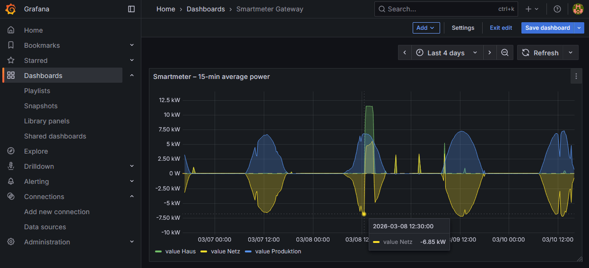

# SmartmeterGateway

Minimal .NET 8 console tool to download available 15-minute smart meter readings (consumption + feed-in) from an SMGW (IF_GW_CON / m2m) and export them to CSV and/or InfluxDB.



## Requirements

- .NET SDK 8.x
- Network access to your gateway

## API documentation

- Compact IF_GW_CON notes: [`doc/IF_GW_CON_API.md`](doc/IF_GW_CON_API.md)

## Configuration

Main config file:

- `SmartmeterGateway/appsettings.json`

Template:

- [`SmartmeterGateway/appsettings.example.json`](SmartmeterGateway/appsettings.example.json)

Important fields:

- `OutputRoot`: target directory (default: `output`)
- `Outputs`
  - `Csv.Enabled`: enable/disable CSV output
  - `InfluxDb.Enabled`: enable/disable InfluxDB output
  - `InfluxDb.Url` / `Org` / `Bucket` / `Token`
  - `InfluxDb.Measurement` (default: `smartmeter_readings`)
  - `InfluxDb.AllowInvalidServerCertificate`
- `Meters[]`: list of gateway endpoints
  - `Active`: `true`/`false`
  - `Name`: optional (used for output folder naming)
  - `BaseUrl`: e.g. `https://192.168.178.3/`
  - `Username` / `Password`
  - `AllowInvalidServerCertificate`: disables TLS certificate validation (local/debug only)

Do not commit credentials from `appsettings.json`.

## Build and run

```bash
dotnet build .\SmartmeterGateway\SmartmeterGateway.csproj -c Release
dotnet run --project .\SmartmeterGateway\SmartmeterGateway.csproj -c Release
```

## Releases

- Prebuilt executables are published in GitHub Releases:
  - https://github.com/maf-soft/SmartmeterGateway/releases/latest
- Download the archive for your platform (for example `win-x64`, `linux-x64`, `linux-arm64`).

## Output files

For each active meter, files are written to `OutputRoot/<meterKey>/`:

- `user-info.json`
- `usage-point-info-*.json`
- `readings-15min-bezug.csv`
- `readings-15min-einsp.csv`

CSV format:

- Header: `TargetTimeUtc,Value`
- UTC timestamps

## Incremental behavior

Each enabled output keeps its own cursor:

- CSV: reads the last timestamp/value from the CSV file.
- InfluxDB: queries the latest point (`time` and `value`) from the configured measurement, filtered to this source (`meter`, `direction`, `database='origin'`).

If any enabled output has no cursor, a backfill is triggered so all outputs can catch up.

## InfluxDB 3 quick setup (local)

Example (PowerShell):

```powershell
Set-Location C:\InfluxDB3
.\influxdb3.exe serve --data-dir "C:\InfluxDB3\data" --node-id home
```

Set host/token once per shell session:

```powershell
$env:INFLUXDB3_HOST_URL = "http://127.0.0.1:8181"
$env:INFLUXDB3_AUTH_TOKEN = "<your-token>"
```

Create database:

```powershell
.\influxdb3.exe create database home
```

## Grafana example (two-meter cascade)

The following example shows a two-meter cascade (`Netz` and `Haus`) where a PV system sits between
the two meters. Each meter's BEZUG and EINSP readings are combined into a single signed value
(positive = consumption, negative = feed-in), and `Produktion` is derived algebraically from the
two signed values.

`delta * 4` converts Wh/15 min to average W for the interval.

In Grafana: `Time column = time`, `Metric column = metric`, `Value column = value`, `Unit = W`.  
Setting **Fill opacity** to `25` for all series gives a clear area chart.

An importable dashboard JSON is available at [`doc/grafana-dashboard.json`](doc/grafana-dashboard.json).

```sql
WITH d AS (
  SELECT
    time,
    CASE WHEN meter='1ISK0000000001' THEN 'Netz'
         WHEN meter='1ISK0000000002' THEN 'Haus'
         ELSE meter END AS meter,
    direction,
    (value - LAG(value) OVER (PARTITION BY meter, direction ORDER BY time)) * 4 AS delta
  FROM home_readings
  WHERE "database"='origin'
    AND direction IN ('EINSP','BEZUG')
    AND $__timeFilter(time)
),
signed AS (
  SELECT
    time,
    meter,
    SUM(CASE WHEN direction='BEZUG' THEN delta ELSE -delta END) AS value
  FROM d
  GROUP BY time, meter
)
SELECT time, meter AS metric, value FROM signed

UNION ALL

SELECT
  time,
  'Produktion' AS metric,
  MAX(CASE WHEN meter='Haus' THEN value END)
  - MAX(CASE WHEN meter='Netz' THEN value END) AS value
FROM signed
GROUP BY time
ORDER BY time, metric;
```

## Notes

- Some gateways are strict with JSON/HTTP framing. This tool sends `Content-Type: application/json` without charset and sets `Content-Length` explicitly.
- Gateway reading windows are limited to ~31 days, so data is fetched in chunks.
- `AllowInvalidServerCertificate=true` should only be used for local testing.

## Platform support

- Development and testing so far was done on **Windows**.
- The project should also run on **Linux** because it is a .NET 8 console app and uses no Windows-only APIs in the code path.
- For Linux usage:
  - install .NET SDK 8.x
  - use Linux paths in your shell commands (for example `dotnet run --project ./SmartmeterGateway/SmartmeterGateway.csproj -c Release`)
  - provide reachable gateway/IP routing and valid credentials in `appsettings.json`

## Gateway networking (fixed IP setups)

- Some gateways use fixed/default IP setups that do not integrate easily into a normal home LAN.
- Practical options can include:
  - direct cable to a dedicated NIC/port on the PC
  - a router/NAT setup that maps IP/port between gateway segment and local LAN
- A MikroTik router has been used successfully for this integration in practice.
- If you run into this networking topic, questions are welcome.

## Author

- Moritz Franckenstein
- GitHub: `maf-soft`
- Email: `^ [at] gmx.net`

## License

MIT License. See [LICENSE](LICENSE).
